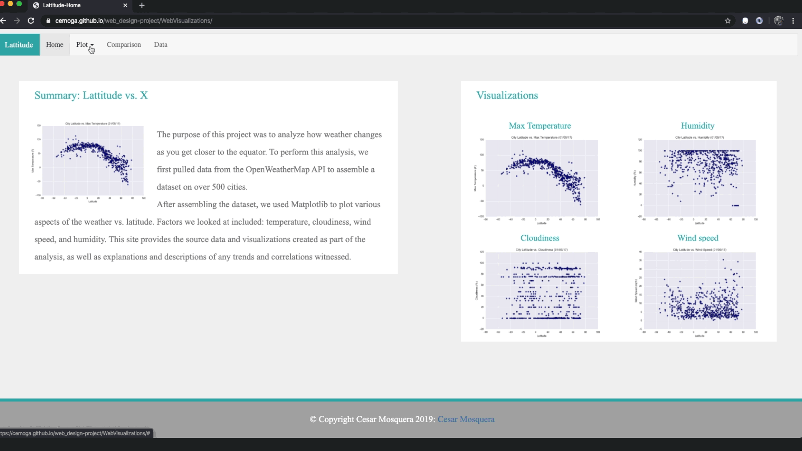

# How Weather is Affected by Latitude - Web-Design

## Project Description

The purpose of this project was to create a visualization to show how the weather changes depending on the latitude. The information was previously collected with Python the OpenWeatherMap API to assemble a dataset on over 500 cities. It was then plotted using Matplolib and the charts exported to png files.

### Link to the deployed site

[Weather vs. Latitude - https://cemoga.github.io/web_design-project](https://cemoga.github.io/web_design-project "Deployed Project")
